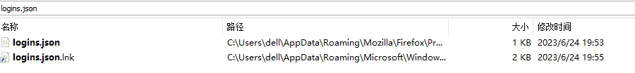
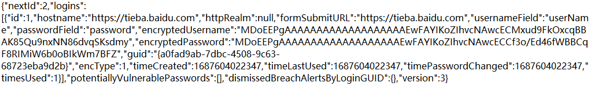
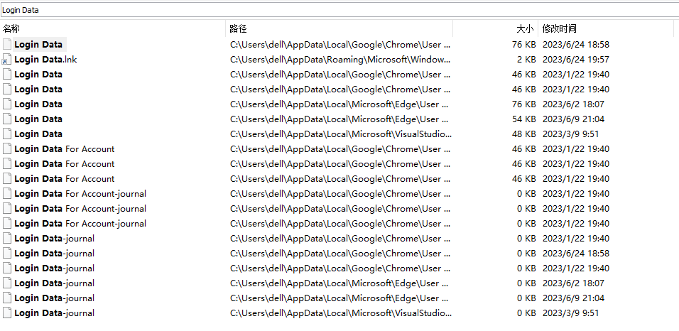
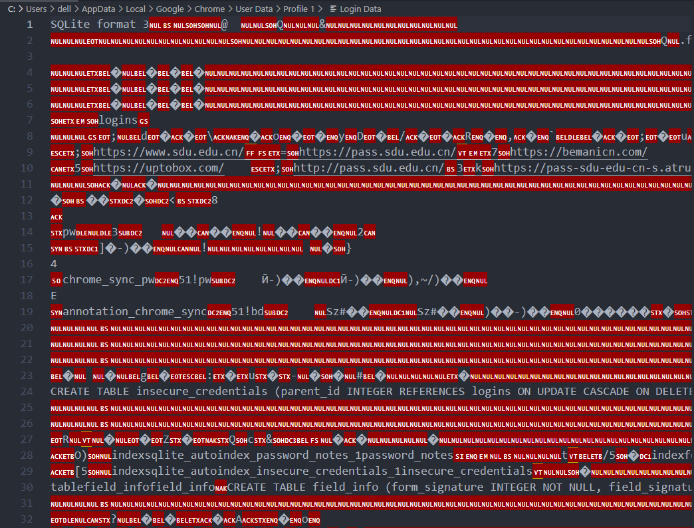

# Project17: 比较Firefox和谷歌chrome的记住密码插件的实现区别

首先Firefox和chrome分别将密码信息存储在"logins.json"和"Login Data"文件中，Firefox的密码存储文件可以直接打开并查看内容，而chrome则不能。

## Firefox

Firefox保存密码的文件和内容如下：

可以发现Firefox保存密码文件中存储了密码的加密形式，以及一些其余的与密码相关的信息。

## chrome

chrome保存密码的文件和内容如下：

而chrome保存密码文件本身就是加密过的，使用文本编辑器打开无法辨认具体内容，只能看到一些不完整的url信息等等。

## 总结

Firefox和chrome保存密码的方式有很大不同，Firefox将加密后的密码保存到一个json格式的文件中，其他信息仍为明文；而chrome则将保存密码的文件进行加密，无法得到有效信息。