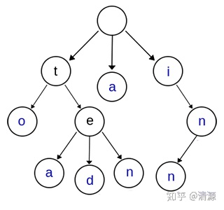
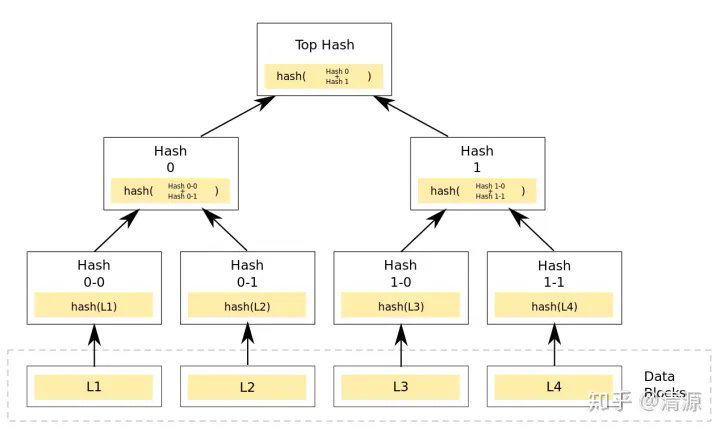
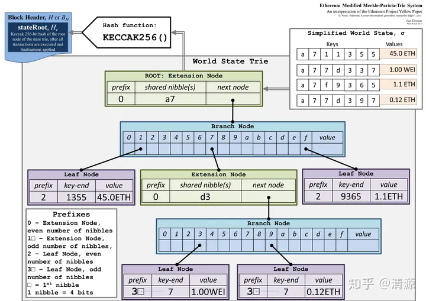
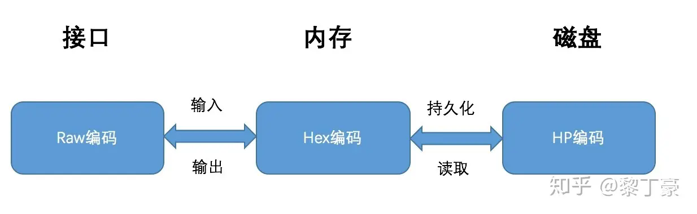

# Project22: research report on MPT

## 概述

默克尔帕特里夏树（Merkle Patricia Tree，MPT）是一种结合了Merkle tree和前缀树两种树形结构优点的数据结构，在以太坊中用于组织管理账户数据、生成交易集合哈希的重要数据结构。

MPT的核心思想是使用哈希函数和前缀压缩来构建树形结构。它将Key和值Value映射到唯一的哈希值，并将数据存储在树的叶节点中。

## 字典树（Trie）

Trie又称前缀树或字典树，是一种有序多叉树。

每个节点各包含一个字符，到叶子节点的字符连接起来就是存储的数据。

## Merkle tree

具体内容同Project5。

## MPT

### 1.节点

MPT树的节点分为以下四种：
1.空节点：空节点单纯表示空，在代码中使用一个空串表示。
2.叶子节点：叶子节点表示为一个[key,value]的键值对，其中key是key的MP编码，value是value的RLP编码。
3.分支节点：分支节点是一个长度为17的list，前16个元素对应着key中的16个可能的十六进制字符，如果有一个键值对在这个分支节点终止，最后一个元素代表一个值，即分支节点既可以搜索路径的终止也可以是路径的中间节点。
4.扩展节点：表示为[key，value]的一个键值对，但是这里的value是其他节点的hash值，这个hash可以被用来查询数据库中的节点。也就是说通过hash链接到其他节点。

### 2.编码

在以太坊中，MPT树的key值共有三种不同的编码方式，以满足不同场景的不同需求。

三种编码方式分别为：
1.Raw编码：原生的key值，不做任何改变。
2.Hex编码：把一个8位的字节数据用两个十六进制数展示出来，Hex编码后的长度是源数据的2倍。
3.Hex-Prefix编码：区分leaf和extension，并把奇数路径变成偶数路径。

编码转换方式如下：
1.Raw编码：当数据项被插入到树中时，Raw编码被转换成Hex编码。
2.Hex编码：当树节点被持久化到数据库时，Hex编码被转换成HP编码。
3.HP编码：当树节点被加载到内存时，HP编码被转换成Hex编码。

### 3.主要结构

如前所述，有四种节点类型存储在MPT树中，存入的值是键值对的形式。根节点为扩展节点，采用了压缩前缀树的方式对数据进行了合并。下面为分支节点，在分支节点可以找到叶子节点或是继续查找接下来的路径。而叶子节点则用来存储具体的数据。