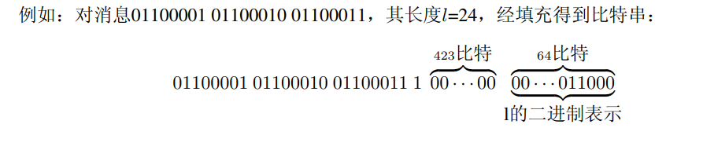
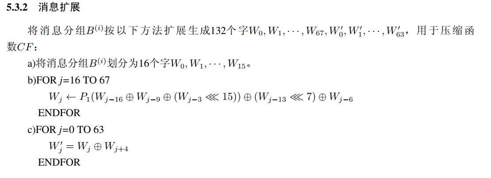
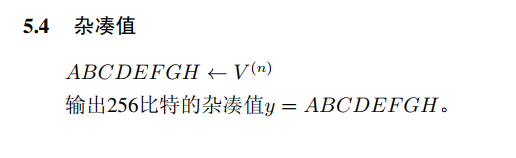
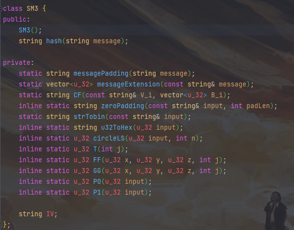
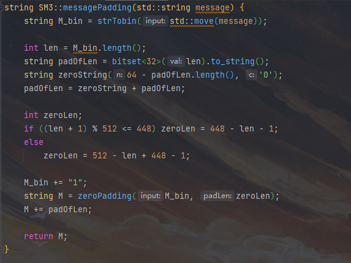
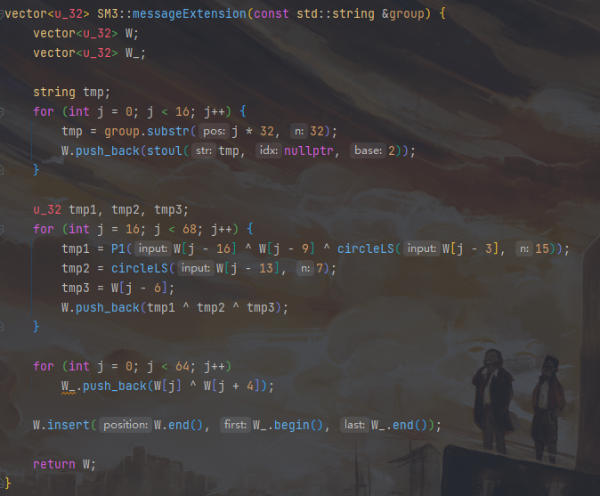
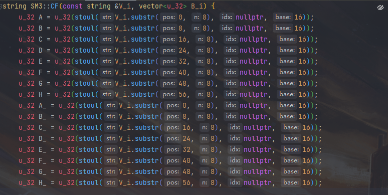
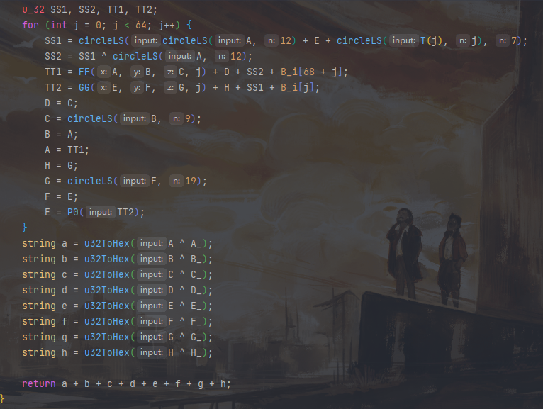
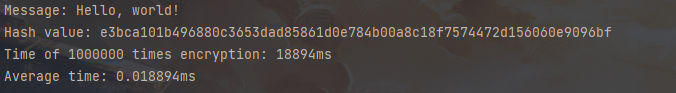

# Project4: do your best to optimize SM3 implementation (software)

## SM3

### 消息填充

将输入的消息转为二进制串，然后先填充一个1，后面加上k个0，k满足等式(n+1+k) mod 512 = 448。然后填充64位的数据，数据内容为消息的长度。

### 消息扩展

### 迭代压缩

### 输出结果

## 代码实现

### SM3类：

### 消息填充函数：

### 消息扩展函数：

### 迭代压缩函数：

## 运行结果

执行100w次加密花费大约19000ms，平均单次加密花费约0.019ms.
