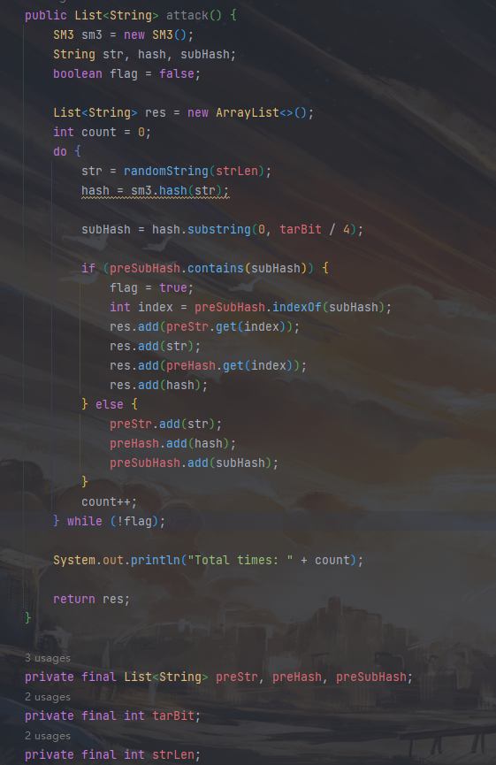
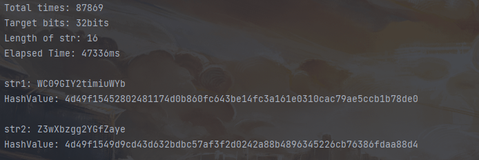

# Project1: implement the naïve birthday attack of reduced SM3

## 生日攻击

根据生日悖论，对于长度为2^n的hash值，只需要枚举2^(n/2)次即可找到一对碰撞。

## 代码实现

函数attack()中对字符串进行枚举，当出现前n比特相同的hash值时返回结果。函数check()用于检查hash值的前n比特是否相同。

## 运行结果

寻找24比特的hash碰撞使用了10000+ms的时间。

