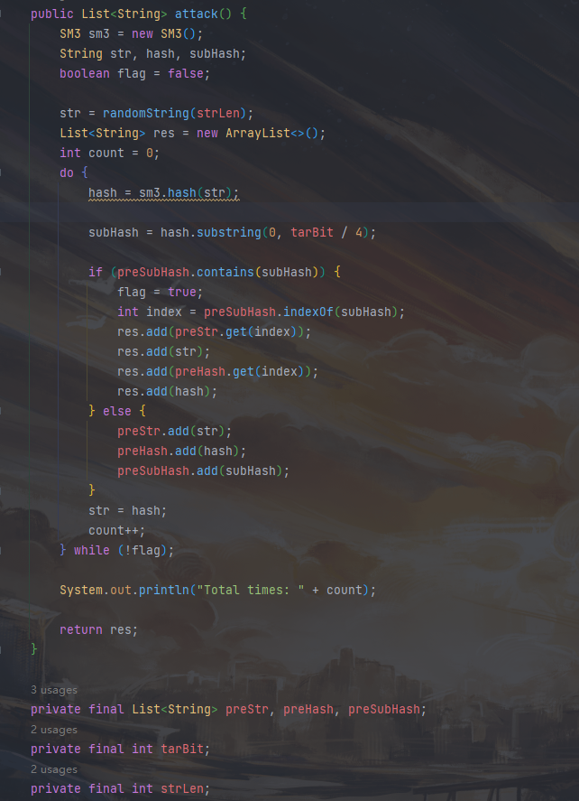
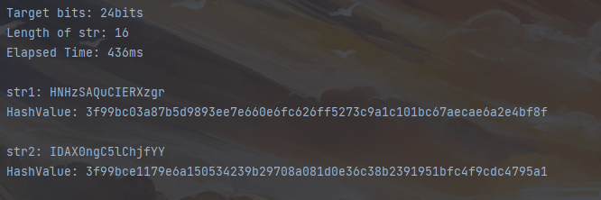

# Project2: implement the Rho method of reduced SM3

## Rho method

对一个初始字符串不断进行hash，在迭代过程中检测循环来发现碰撞。

## 代码实现

函数attack()中，将每个计算过的hash值存入preSubHash中，并在每次计算新的hash值时查找是否已经含有该hash值。

## 运行结果

对于24比特的碰撞，只使用了400+ms的时间，效果明显优于生日碰撞攻击。

