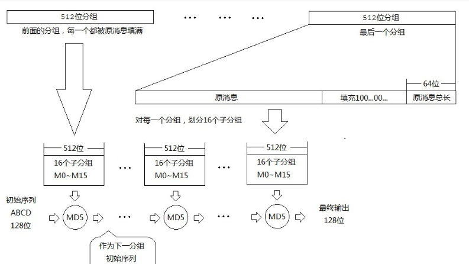
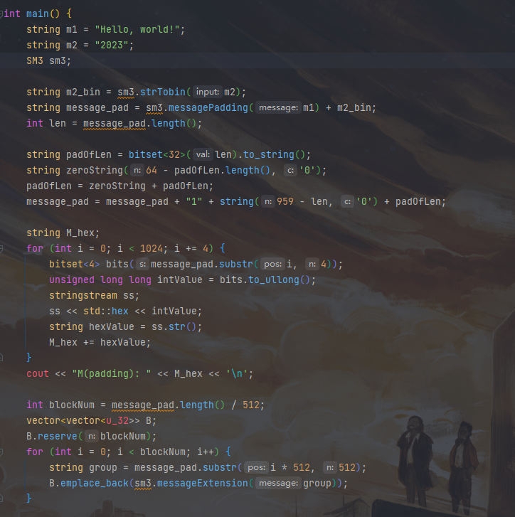
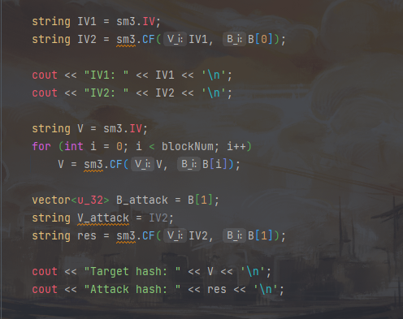
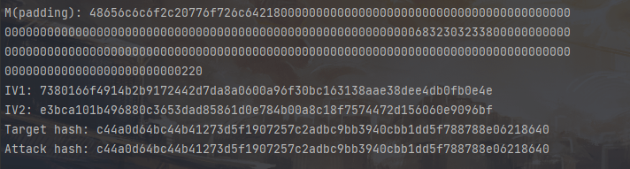

# Project3: implement length extension attack for SM3, SHA256, etc.

## 长度扩展攻击

对于基于MD结构的hash函数，并可得到输入和对应输出hash值，即可进行长度扩展攻击。

## 代码实现

SM3的具体实现同Project4。
选取明文m1、m2，将m2作为攻击所使用的字符串。攻击时先使用修改后的填充函数，将消息m1||m2进行填充，并计算出两个向量IV1、IV2;得到IV2后，即可对目标进行长度扩展攻击。

## 运行结果

