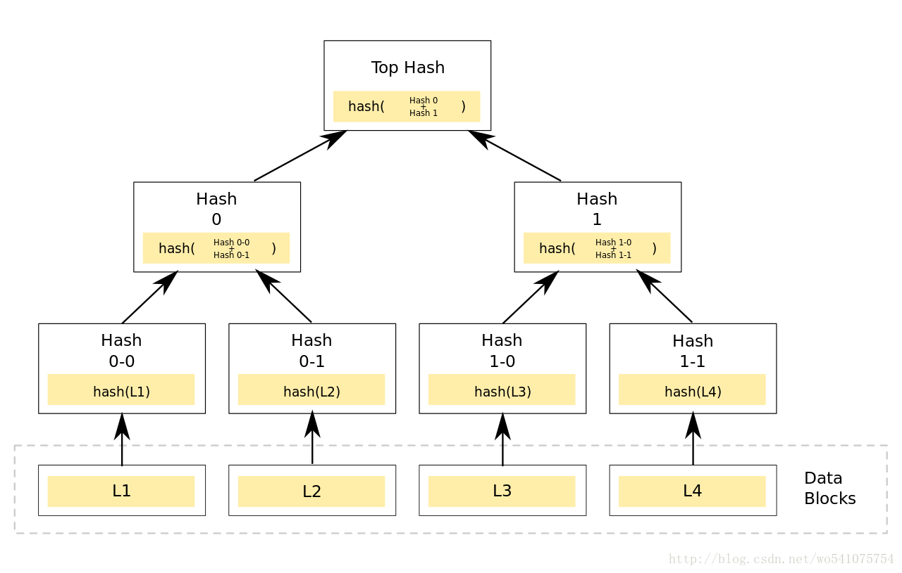
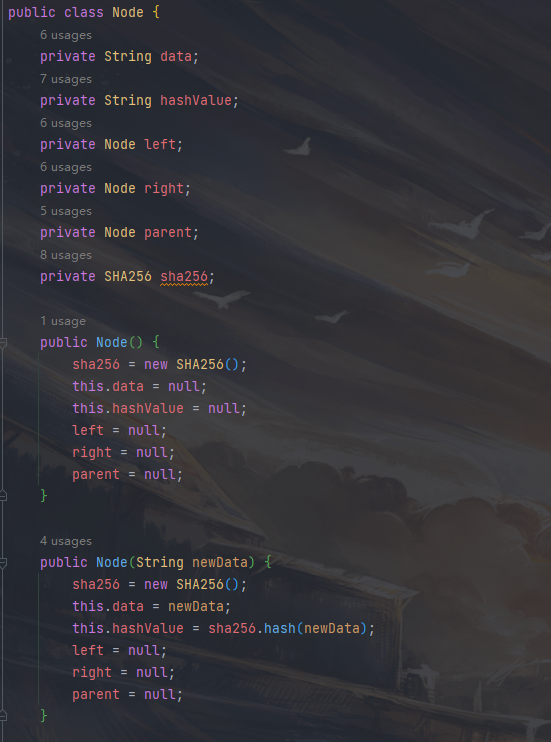
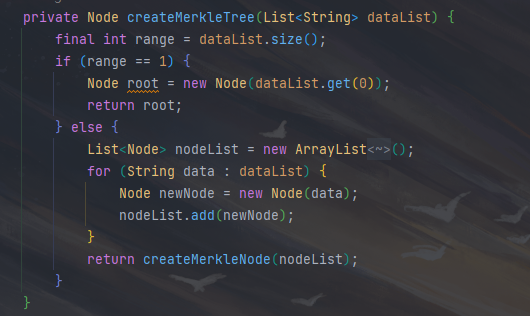
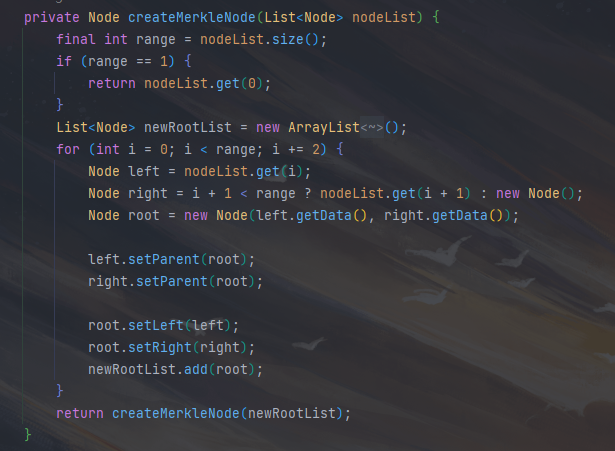
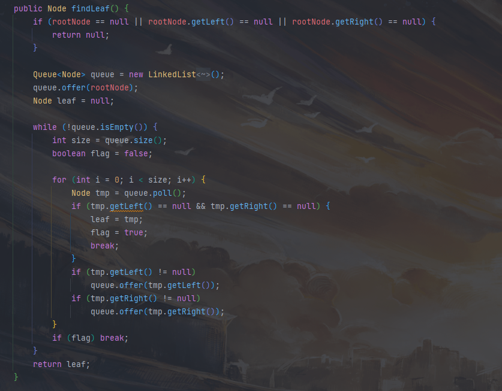
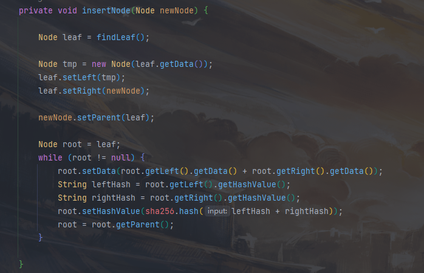
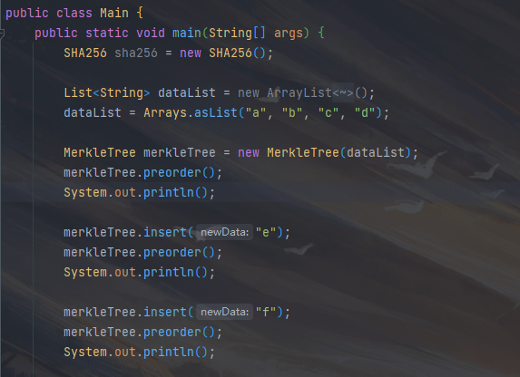
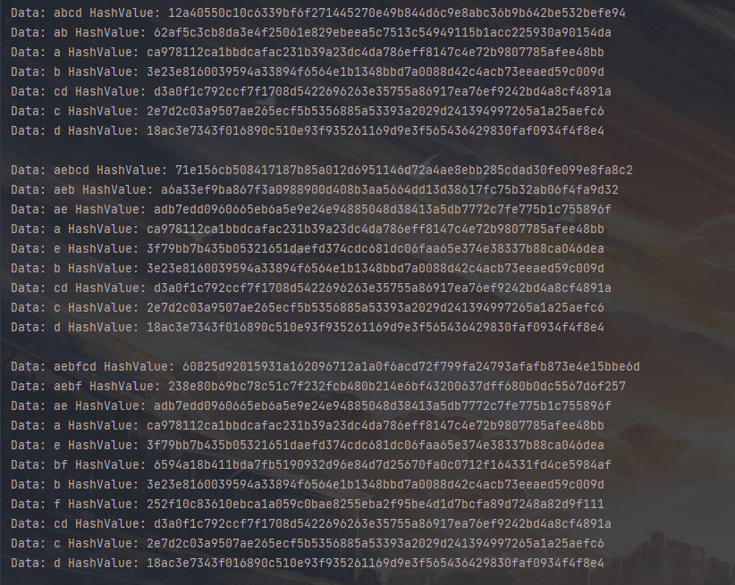

# Project5: Impl Merkle Tree following RFC6962

## Merkle tree

Merkle tree一般是二叉树结构，最底层为数据块，经过hash后成为叶子节点。非叶子节点则是根据它下面所有的叶子节点值hash后得到。

## 代码实现

### 节点类

每个节点包含数据、hash值、左右节点以及父节点，以及一些常规的二叉树操作。

### Merkle tree类

建立Merkle tree类时接收一个数据列表，根据列表建立Merkle tree。

### 建立Merkle tree

根据输入列表的长度选择建树方式，并在建树完成后返回列表。

### 建立Merkle tree节点

根据range判断是否超出输入节点数，每次创建左右两个节点，并与父节点连接。

### 查找一层中没有两个叶子节点的第一个节点

层次遍历查找查找一层中没有两个叶子节点的第一个节点，用于插入新节点。

### 插入新节点

首先找到应该插入新节点的位置，然后计算插入新节点后该节点新的hash值，然后递归更新父节点的hash值。

## 运行结果

根据输入的字符串列表建立Merkle tree，然后插入新节点并进行前序遍历。

