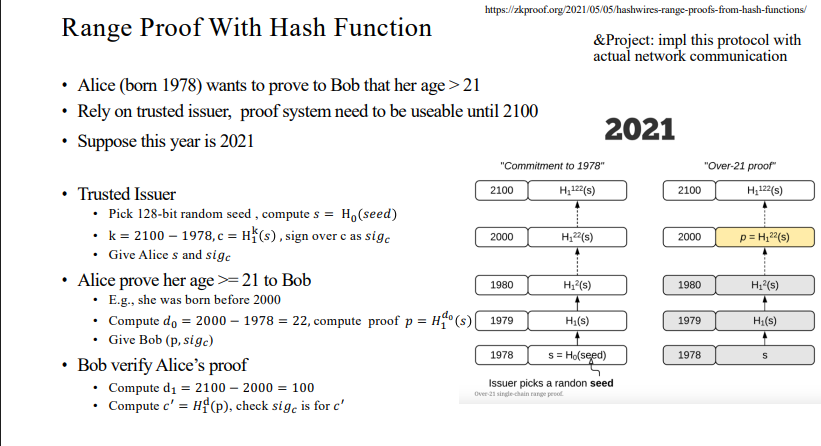

# Project6: impl this protocol with actual network communication

## 主要结构

基于hash函数进行范围证明。

## 代码实现

### Trusted Issuer

Issuer选择随机数种子，并计算其hash值s，然后计算k，并对c做k重hash。最后对c签名并发送给Alice(s, sig_c)。

### Alice

计算d_0，然后计算证明p，并将(p, sig_c)发送给Bob。

### Bob

计算d_1，根据p计算c'，最后根据私钥对签名c'进行验证。

### RSA签名

## 运行结果

三方依次进行操作，最后成功通过验证。

