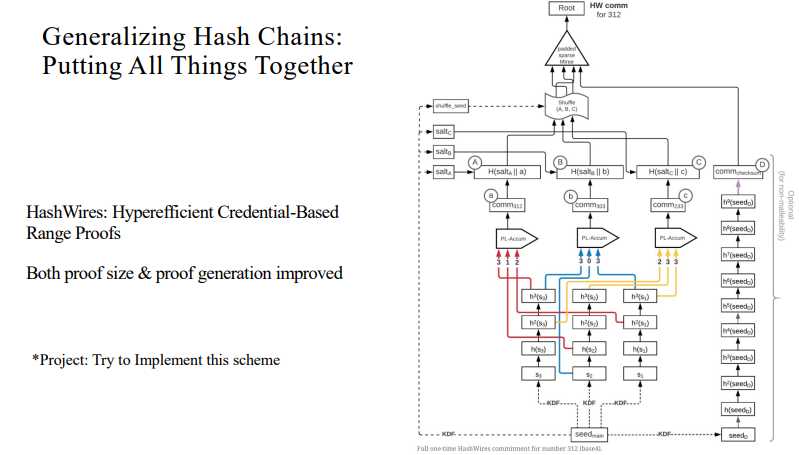
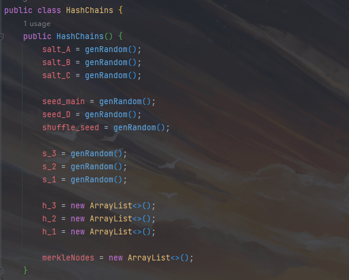
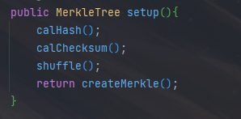
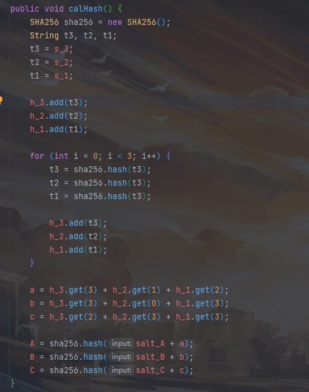
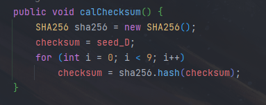
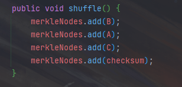
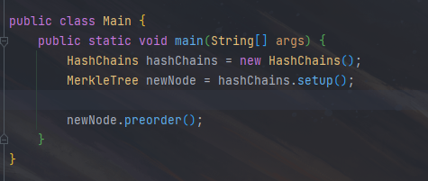
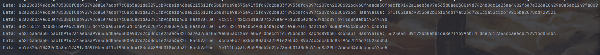

# Project7: Try to Implement this scheme

## 主要结构

## 代码实现

### HashChains类

初始化。

### 建立Merkle tree

进行主要计算步骤后建立Merkle tree，Merkle tree实现同Project5。

### 计算hash值

使用SHA256，计算所需要的各个hash值。

### 计算校验和

### Shuffle操作

## 运行结果

对最终得到的Merkle tree进行前序遍历。

