# Project9: AES / SM4 software implementation

## SM4

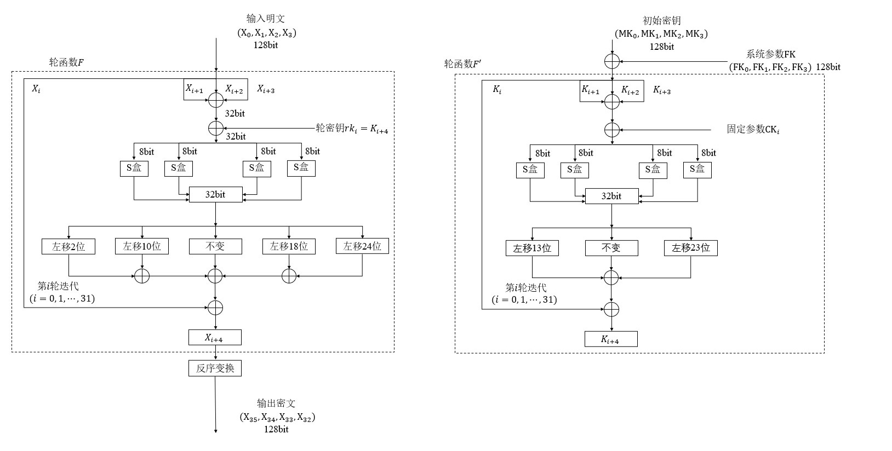

### SM4类

定义S盒和各种常量
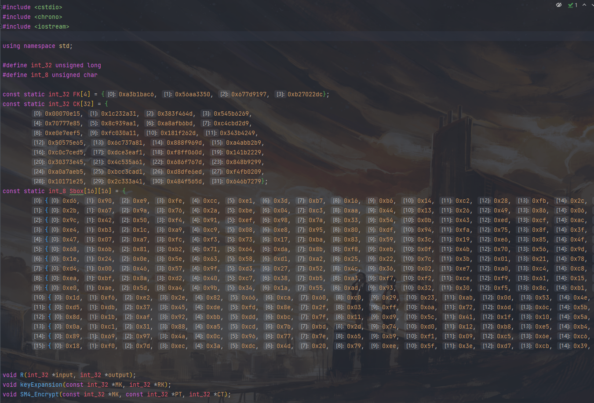

### 密钥扩展

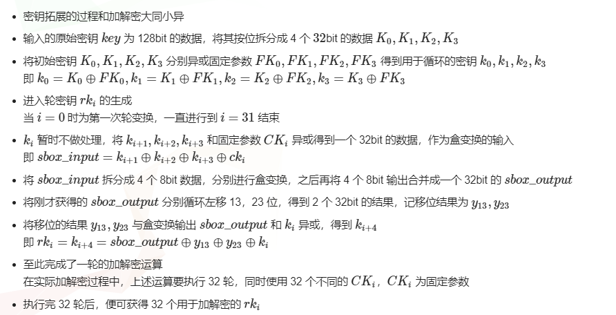

### 加密

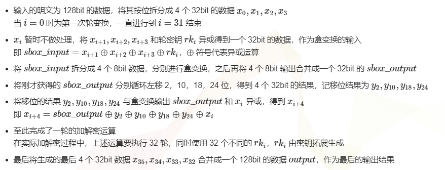
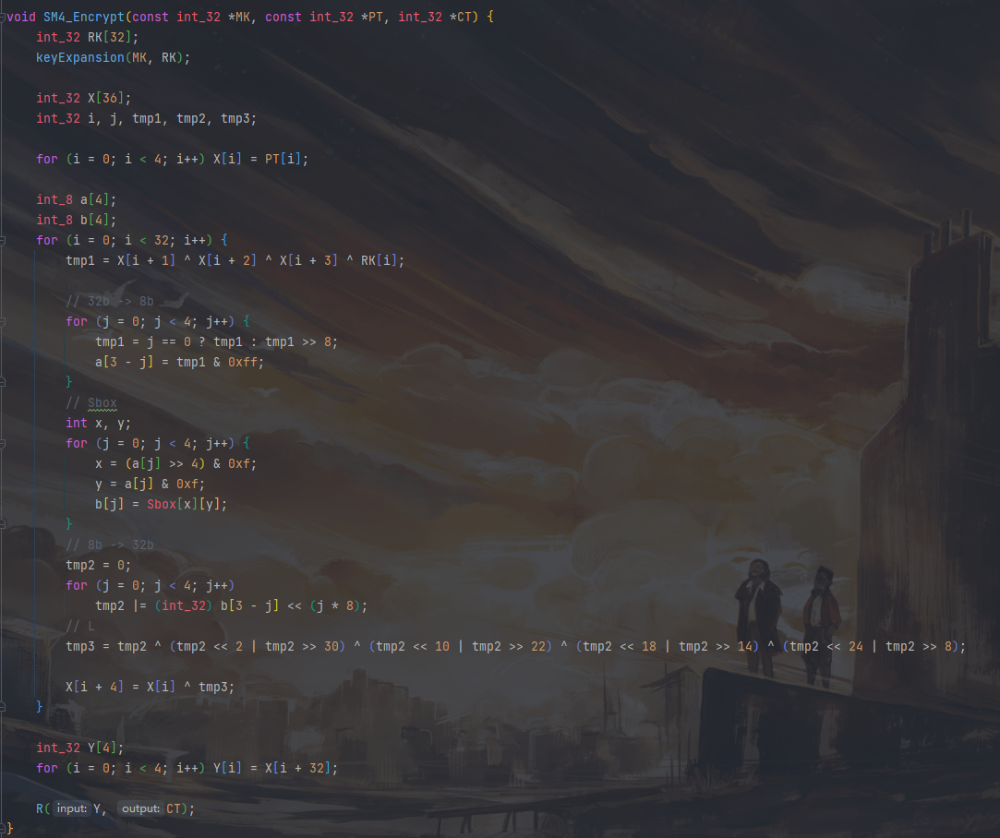

### R函数

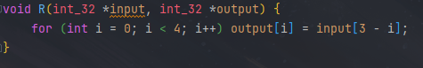

## AES

实现128位的AES加密。

### 密钥扩展

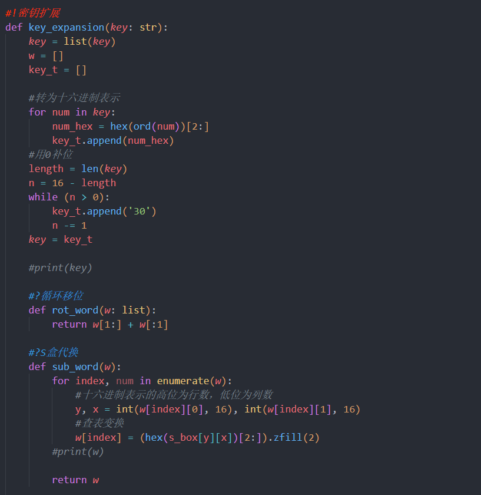
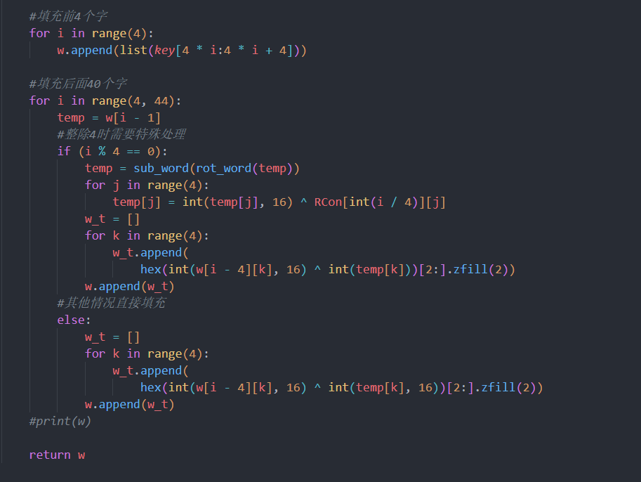

### S盒变换

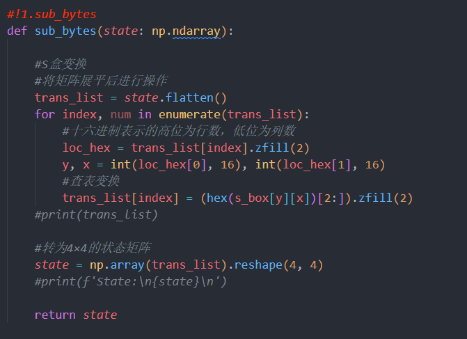

### 行移位

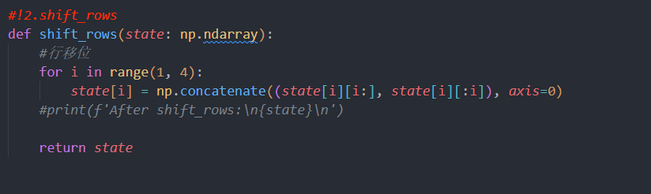

### 列混合

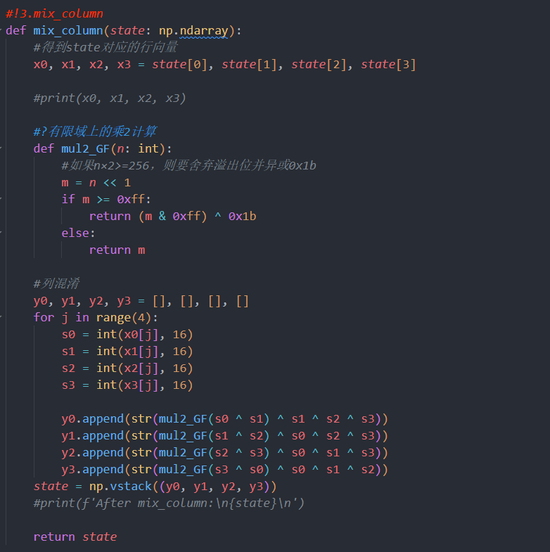

### 轮密钥加

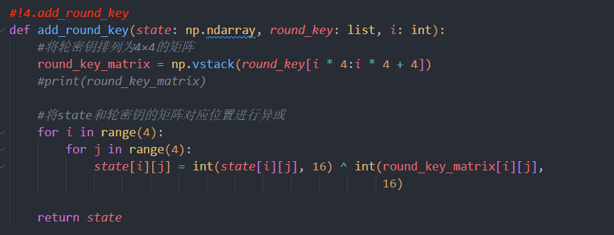

### 加密

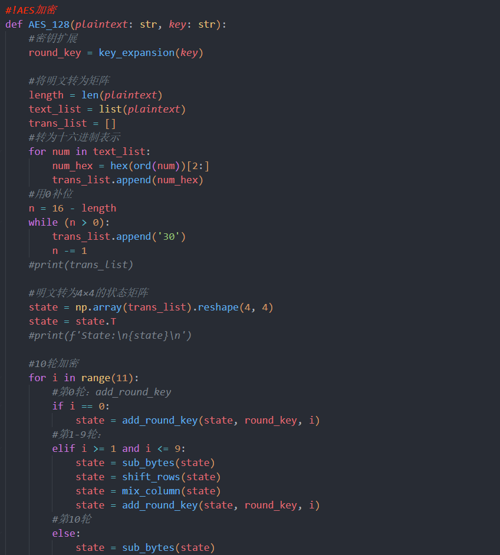
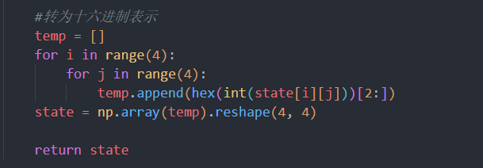

## 运行结果

### SM4

640次加密，单次平均用时大约为0.0027ms。

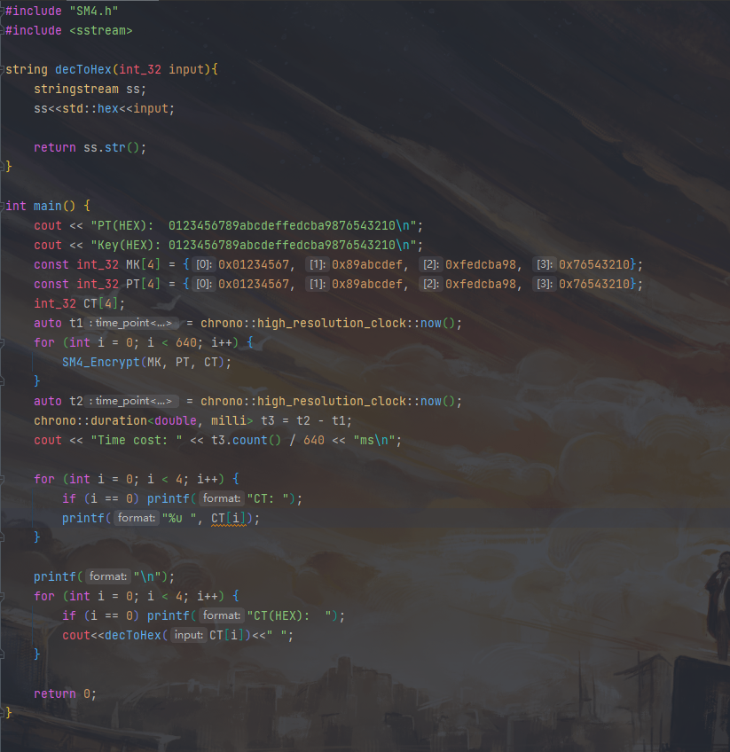
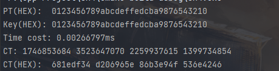

### AES

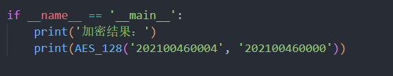
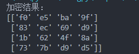
