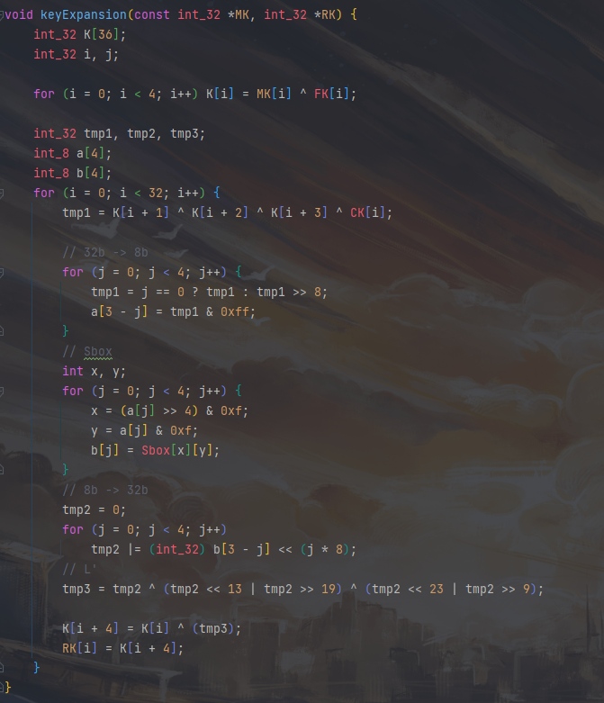

# Project9: AES / SM4 software implementation

## SM4

### SM4类

定义S盒和各种常量

### 密钥扩展

### 加密

### R函数

## AES

实现128位的AES加密。

### 密钥扩展

### S盒变换

### 行移位

### 列混合

### 轮密钥加

### 加密

## 运行结果

### SM4

640次加密，单次平均用时大约为0.0027ms。

### AES

