# Project11: impl sm2 with RFC6979

## SM2

### 加密流程

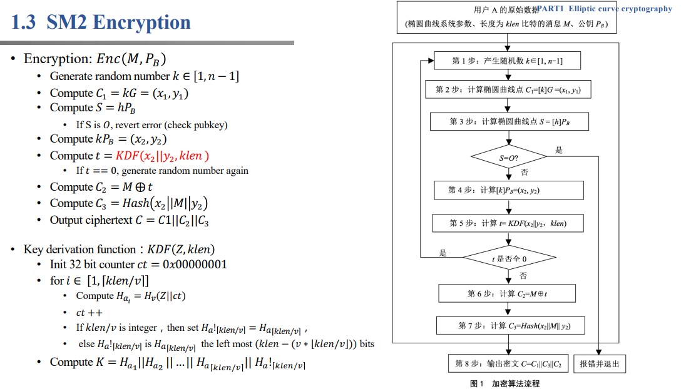

### 解密流程

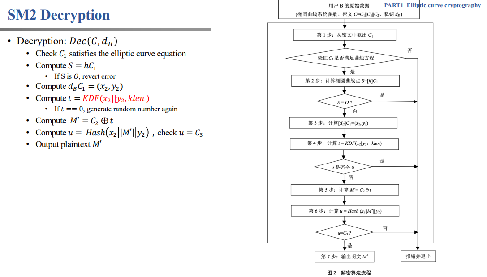

## 代码实现

### 十六进制字符串转十进制数

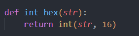

### SM3-hash

使用gmssl的SM3-hash函数。
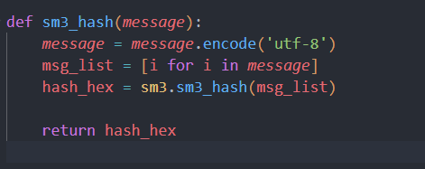

### 求逆元

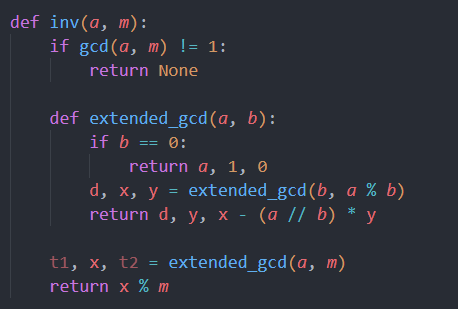

### 椭圆曲线加法

### 二倍点

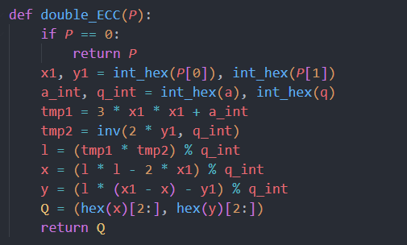

### 多倍点

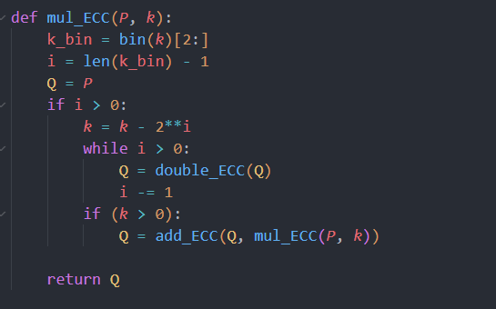

### 检查是否在椭圆曲线上

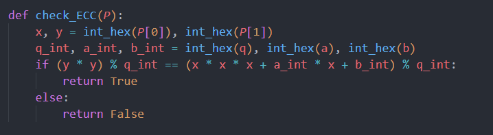

### KDF

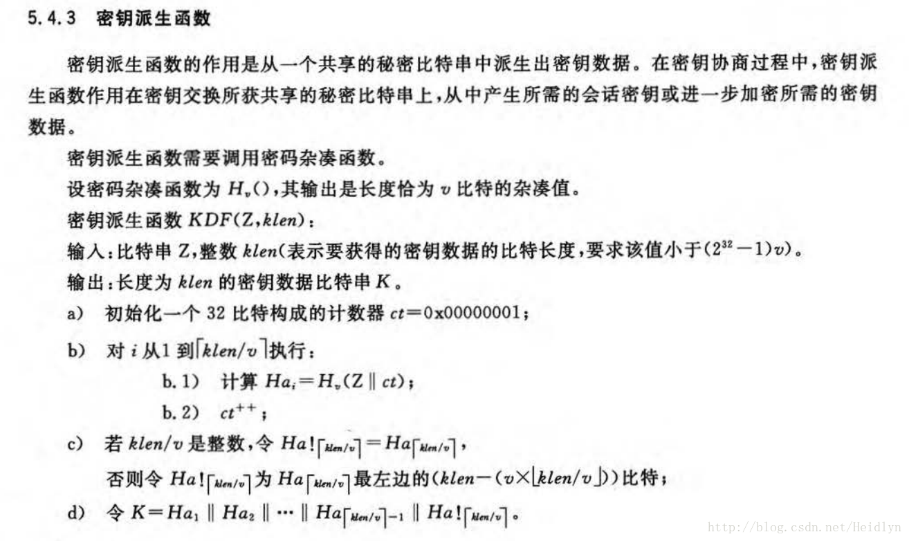
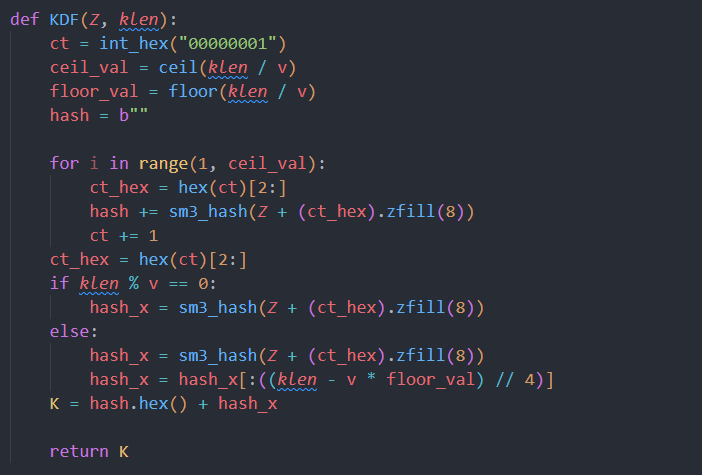

### 加密

同流程图。

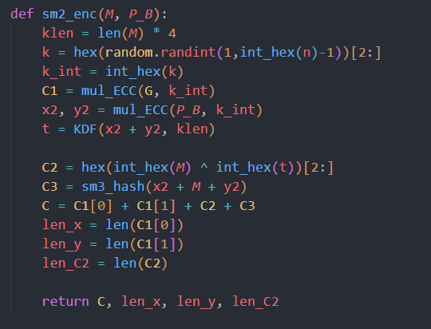

### 解密

同流程图。

### 参数设定

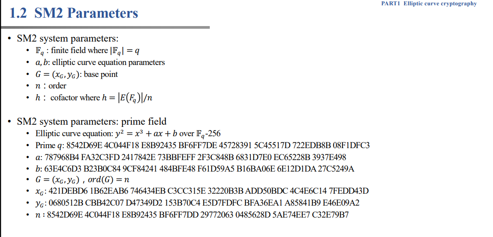
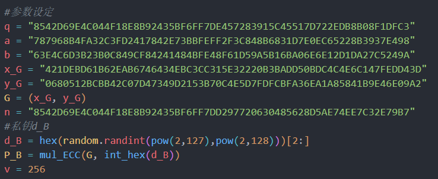

## 运行结果

对随机数进行加密和解密。
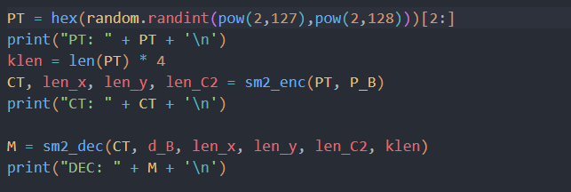
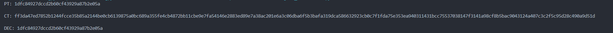