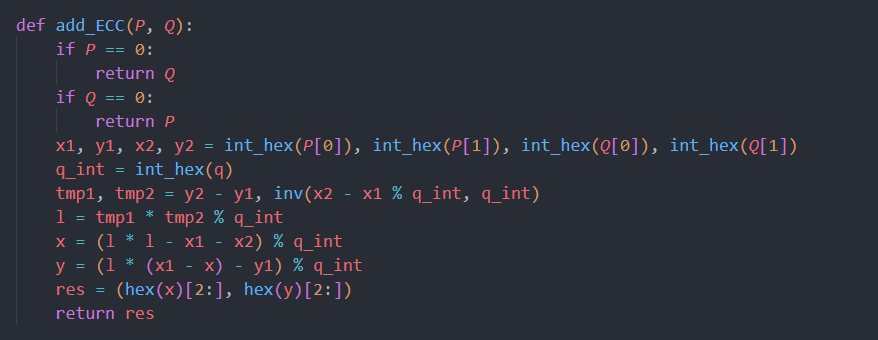

# Project11: impl sm2 with RFC6979

## SM2

### 加密流程

### 解密流程

## 代码实现

### 十六进制字符串转十进制数

### SM3-hash

使用gmssl的SM3-hash函数。

### 求逆元

### 椭圆曲线加法

### 二倍点

### 多倍点

### 检查是否在椭圆曲线上

### KDF

### 加密

同流程图。

### 解密

同流程图。

### 参数设定

## 运行结果

对随机数进行加密和解密。

