# Project12: verify the above pitfalls with proof-of-concept code

## SM2签名

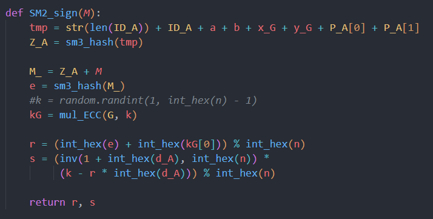

## ECDSA签名

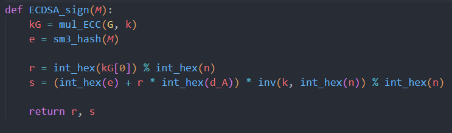

## 泄露k导致d泄露

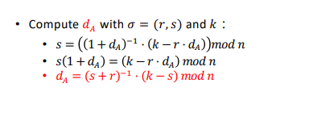
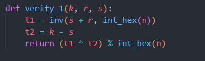

## 重用k导致d泄露

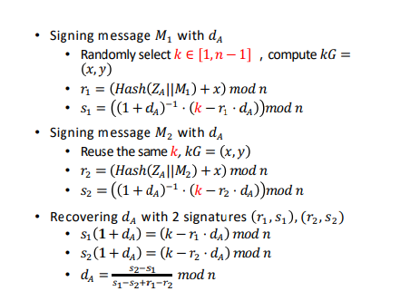
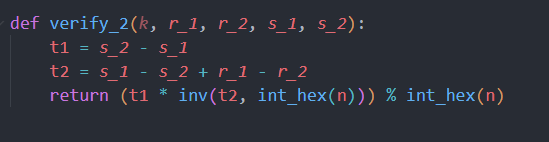

## 两名用户使用同样的k，每名用户都可以推出另一名用户使用的d

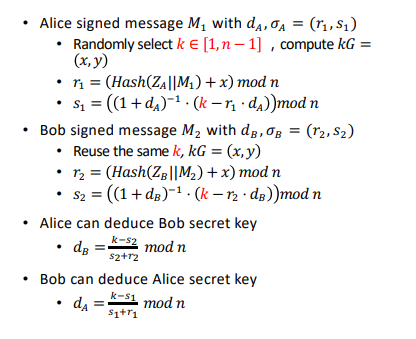
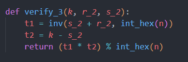

## 在ECDSA签名中使用相同的d和k，导致d泄露

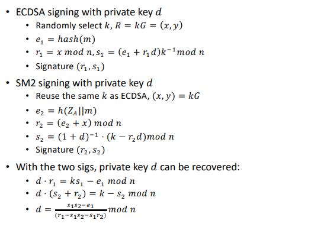
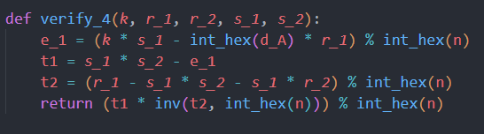

## 运行结果

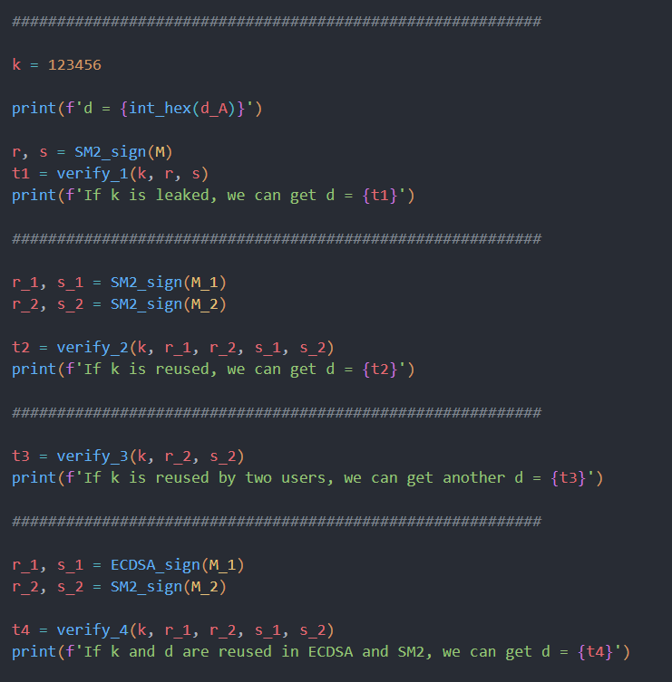
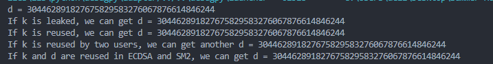