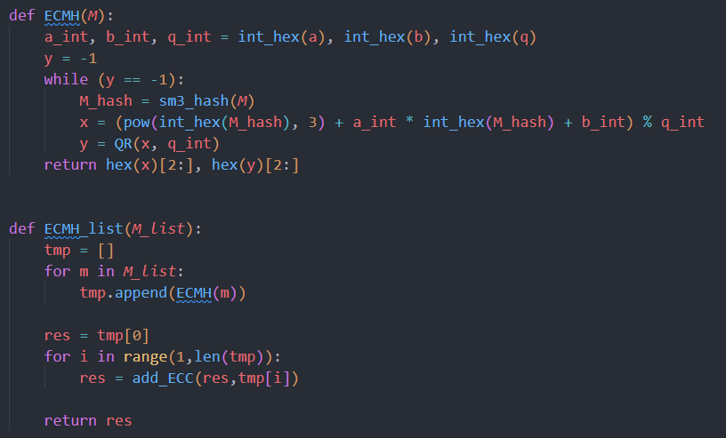
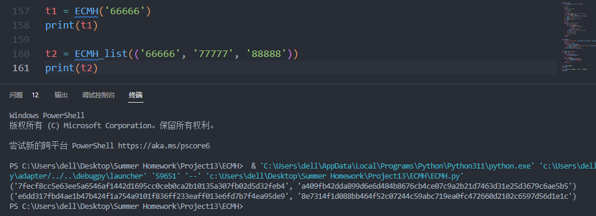

# Project 13: Implement the above ECMH scheme

## 核心思想

ECMH的核心思想是将hash映射为椭圆曲线上的点，利用椭圆曲线上的加法代替原始的hash求和算法，采用ECMH方式比传统的hash求和更加安全。

## 参数选取

采用secp256k1椭圆曲线实现ECMH，参数如下：

## 代码实现

函数ECMH()将明文的hash值映射到椭圆曲线上，以得到x。然后计算y = QR(x)，即y是x的二次剩余。

函数ECMH_list()则实现将多个hash值累加的功能。

## 运行结果

