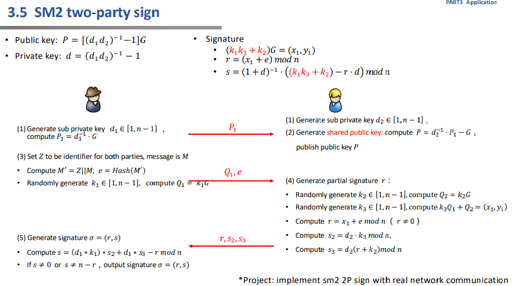
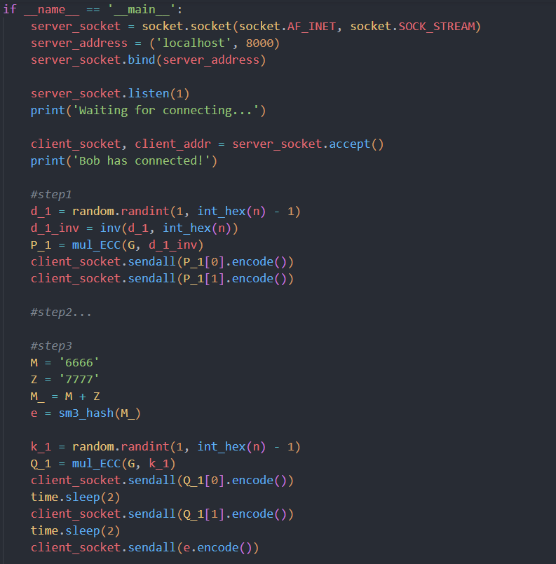
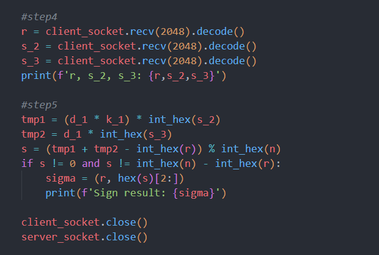
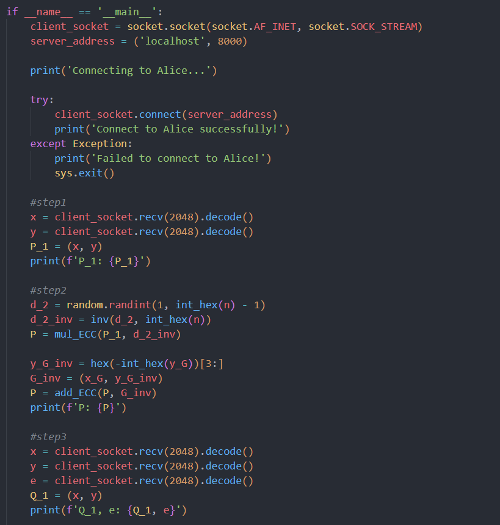
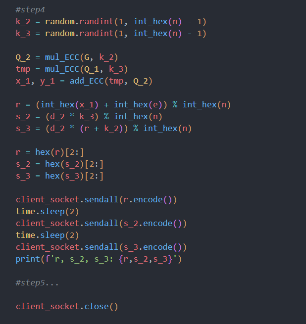
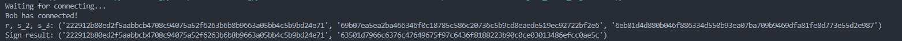
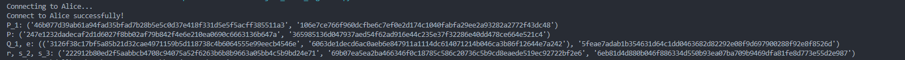

# Project15: implement sm2 2P sign with real network communication

## 主要流程

## 代码实现

### Alice

首先产生随机数d_1，计算P_1，并将P_1发送给Bob；然后计算M'=Z||M和e=Hash(M')，随机生成k_1，并计算Q_1，再将(Q_1, e)发送给Bob；最后接收(r, s_2, s_3)，用这些数据计算s，并得到签名(r, s)。

### Bob

生成随机数d_2，并根据接收的P_1计算公钥P；根据接受的(Q_1, e)计算(r, s_2, s_3)，并发给Alice。

## 运行结果

### Alice端

### Bob端

