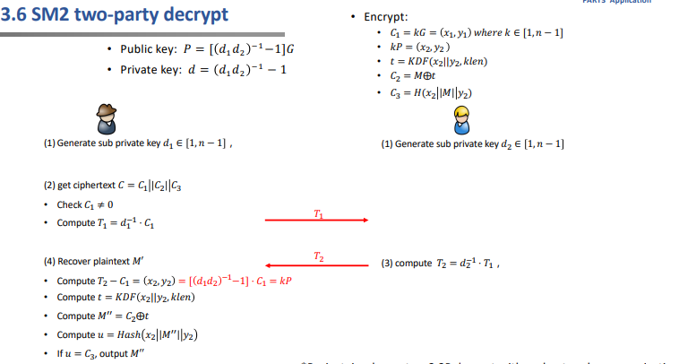
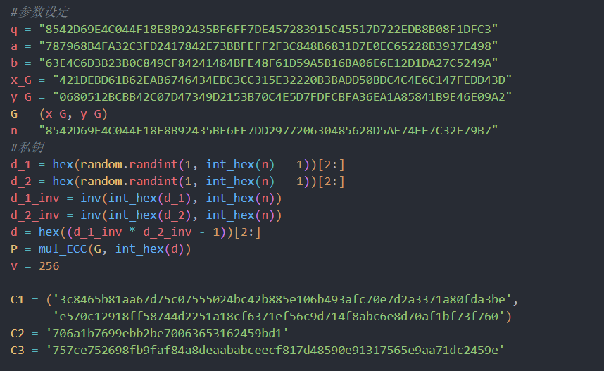
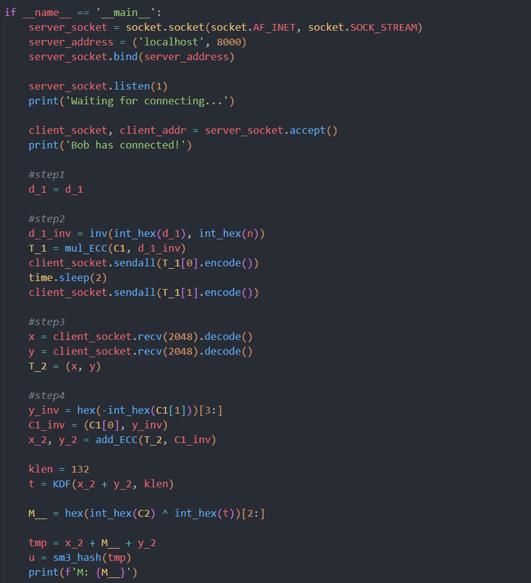
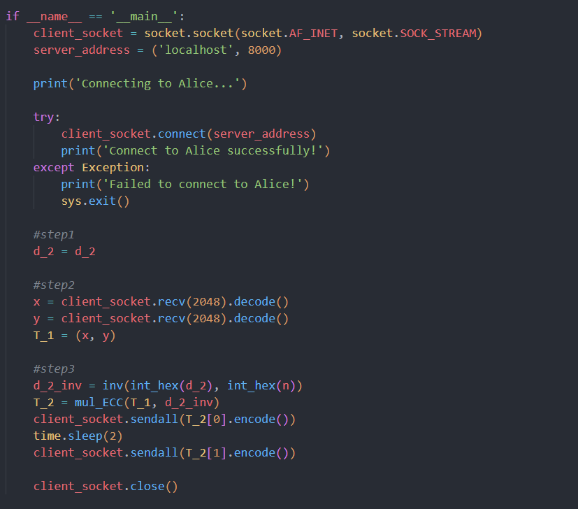
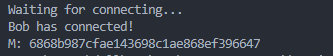

# Project16: implement sm2 2P decrypt with real network communication

## 主要流程

## 代码实现

### 计算公钥P以及C的选取

由于加解密的P和d需要使用新的算法计算，故提前计算出P和d。

### Alice

随机生成d_1，计算T_1，并将T_1发送给Bob；根据收到的T_2，计算T_2-C_1，计算t、M''和u，验证u和t是否相等。

### Bob

随机生成d_2，根据收到的T_1计算T_2并发给Alice。

## 运行结果

### Alice端

### Bob端

