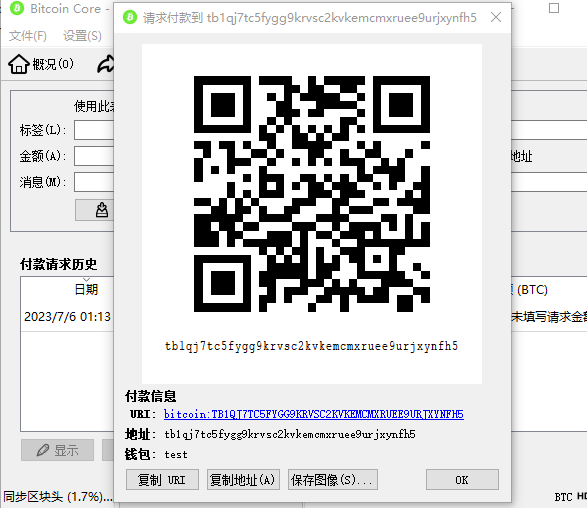
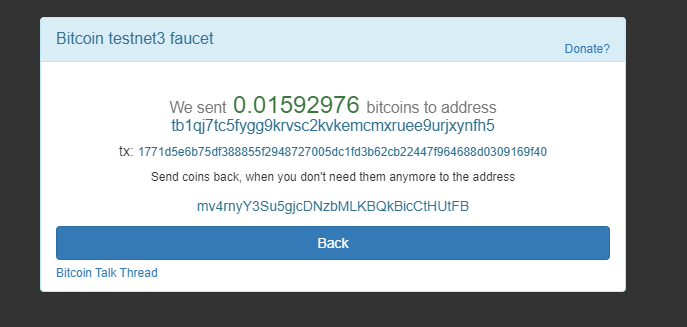
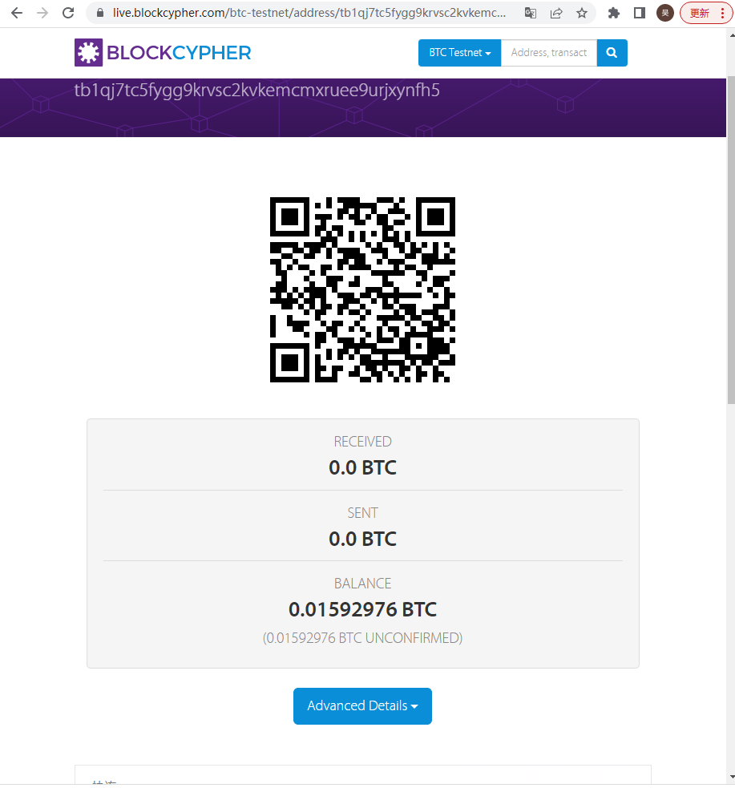
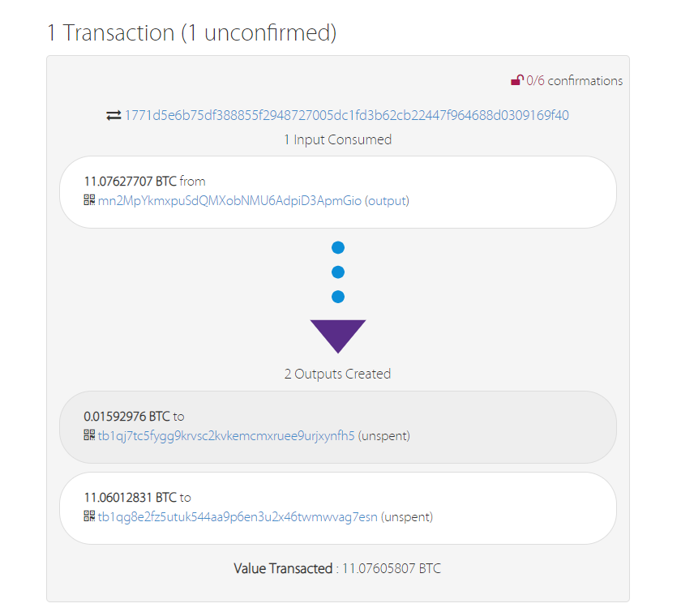
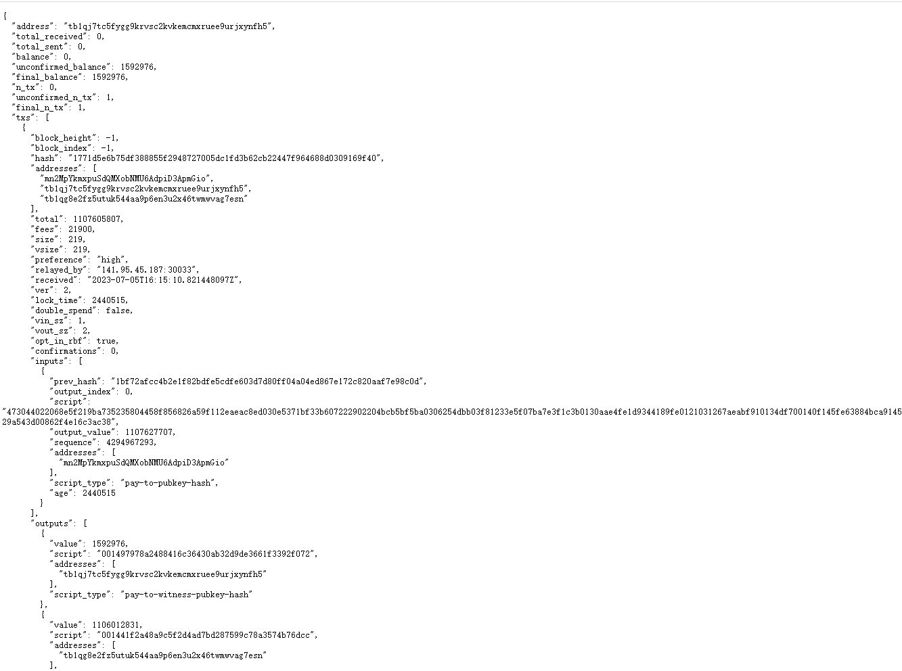

# Project18: send a tx on Bitcoin testnet, and parse the tx data down to every bit, better write script yourself

## 在测试网络中收款

首先需要在测试网络中创建一个新的收款地址：

然后到<https://coinfaucet.eu/en/btc-testnet/>进行收款：

## 解析交易数据

可以在<https://live.blockcypher.com/>查到我们在测试网络中的交易信息：

调用网站提供的API接口即可对交易数据进行解析：

可以看到交易时间，收款、打款的具体信息等等。并且由于是测试网络，区块的hash格式也并不是000...的形式。
